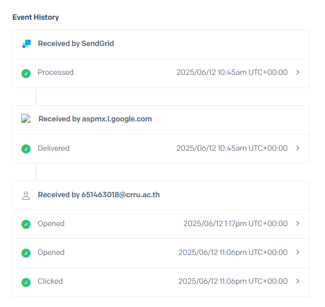

# SendGrid Webhook Event Service

## 📋 Overview

บริการ Webhook สำหรับรับและจัดการ Events จาก SendGrid Email Service โดยเก็บข้อมูลพื้นฐาน 

### ข้อมูลที่จัดเก็บ
| ข้อมูล | รายละเอียด | ตัวอย่าง |
|--------|------------|----------|
| Email | อีเมลที่เกี่ยวข้องกับ event | user@example.com |
| Event Type | ประเภทของ event ที่เกิดขึ้น | delivered, open, click | ฯลฯ |
| Timestamp | เวลาที่เกิด event | 1749769574 |

### คุณสมบัติหลัก
- ✅ รองรับทุก Events จาก SendGrid
- 🔐 ตรวจสอบ Signature อัตโนมัติ
- 💾 บันทึกข้อมูลลง MySQL
- 📝 ระบบ Logging 

### Event Types ที่รองรับ
- 📨 processed
- 📬 delivered
- 👁️ open
- 🖱️ click
- ↩️ bounce
- ⛔ dropped
- 🚫 spamreport
- 📤 deferred
- 🔄 unsubscribe
- ❌ invalid_email
- 🧪 test

### โครงสร้างโปรเจค

```
sendgridtest/
├── cmd/                        # Command และ Entry points
│   ├── main.go                # จุดเริ่มต้นของแอพพลิเคชัน
│   └── sendgrid_events.log    # ไฟล์เก็บ Logs
│
├── config/                     # การตั้งค่าระบบ
│   └── config.go              # ตั้งค่าการทำงานของระบบ
│
├── internal/                   # โค้ดภายในที่ไม่เปิดเผยภายนอก
│   ├── domain/                # โดเมนและ Business Objects
│   │   ├── event.go          # โครงสร้างข้อมูล Event
│   │   └── errors.go         # Custom errors
│   │
│   ├── core/                  # Business Logic
│   │   └── service.go        # จัดการ Event Logic
│   │
│   ├── ports/                 # Interfaces
│   │   ├── repository.go     # Interface สำหรับจัดการข้อมูล
│   │   └── notifier.go       # Interface สำหรับการแจ้งเตือน
│   │
│   └── adapters/              # ส่วนเชื่อมต่อกับระบบภายนอก
│       ├── mysql/            # จัดการฐานข้อมูล MySQL
│       └── lark/             # ส่งการแจ้งเตือนผ่าน Lark
│
├── pkg/                       # แพ็คเกจที่ใช้ร่วมกัน
│   ├── verify/               # ตรวจสอบ Signature
│   └── logger/               # ระบบ Logging
│
└── .env                      #ไฟล์ตั้งค่าสภาพแวดล้อม

```

### การจัดการข้อมูล

#### Database Schema
```sql
CREATE TABLE sendgrid_events (
    id BIGINT AUTO_INCREMENT PRIMARY KEY,
    email VARCHAR(255) NOT NULL,
    event_type VARCHAR(50) NOT NULL,
    timestamp BIGINT NOT NULL,
    created_at TIMESTAMP DEFAULT CURRENT_TIMESTAMP,
    INDEX idx_email (email),
    INDEX idx_event_type (event_type),
    INDEX idx_timestamp (timestamp)
);
```

### Security Layer
- 🔒 ECDSA Signature Verification
- 🔑 Public Key Validation
- ⏰ Timestamp Checking

## ⚙️ การตั้งค่าระบบ

### 2. การเปลี่ยน Lark Bot 🤖

1. สร้าง Bot ใหม่ใน Lark:
   ```markdown
   1. ไปที่ Lark Developer Portal
   2. เลือก "Create Custom App"
   3. ตั้งชื่อและรายละเอียด Bot
   4. เปิดใช้งาน "Bot" feature
   5. สร้าง Custom Bot
   6. คัดลอก Webhook URL
   7. นำไปใส่ตรง config.go  LARK_WEBHOOK_URL
   ```

   ### 3. การตั้งค่า SendGrid Signature Verification 🔐

   1. รับ Public Key จาก SendGrid:
   ```markdown
   1. Login to SendGrid Dashboard
   2. Settings > Mail Settings
   3. Event Settings > Event Webhook
   4. คัดลอก Verification Key
   5. นำไปใส่ตรง .env SENDGRID_PUBLIC_KEY
   ```
   # 🚀 SendGrid Webhook Service - Installation Guide

   ### 1. Clone & Setup Project

```bash
# 1. Clone repository
git clone https://github.com/kunaaa123/SendGrid_webhook
cd sendgridtest

# 2. ติดตั้ง dependencies
go mod download
go mod verify
```

### 2. รันแอพพลิเคชัน
```bash
go run cmd/main.go
```

```bash
ngrok http 8080 ## ติดตั้ง Ngrok เพื่อทำให้เป็น URL สาธารณะ 
```

  #  ตัวอย่างข้อมูล

```markdown

```


